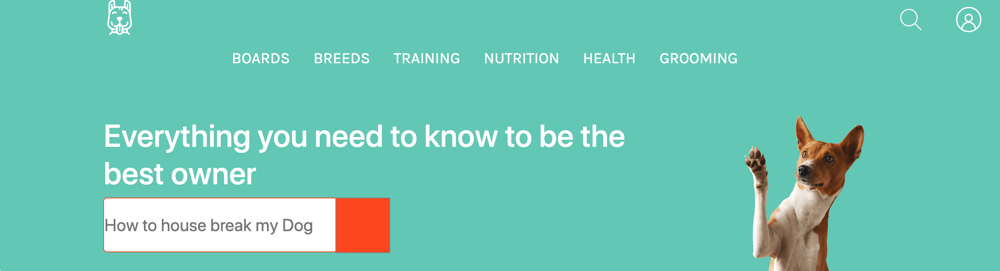
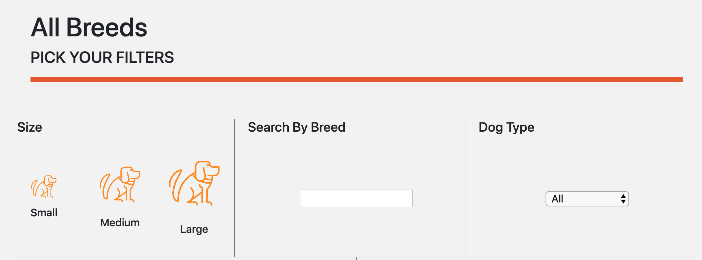
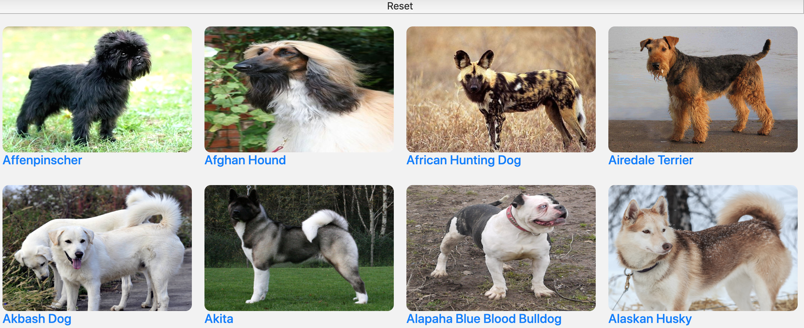
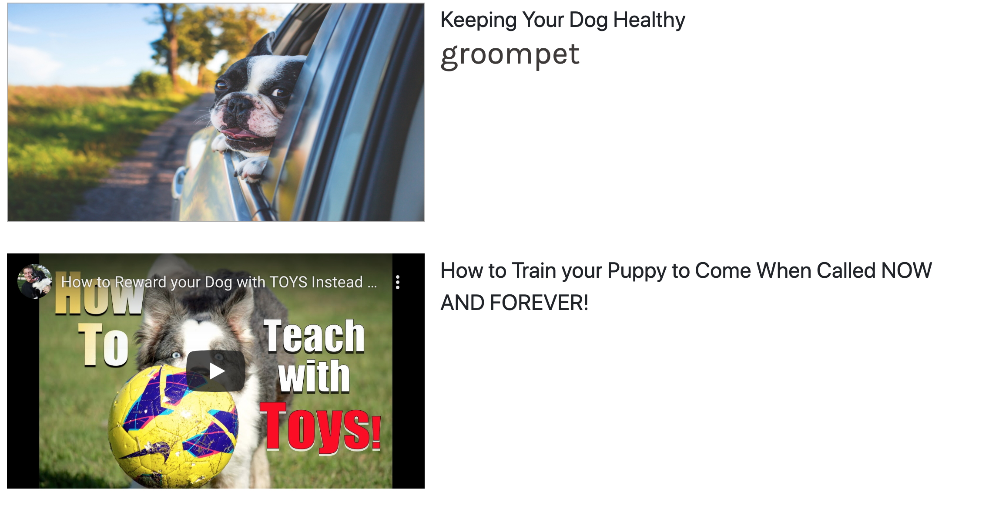

This project was inspired by a UX/UI student. Our team collaborated from wire-framing to final asset hand-off and beyond. This Rails project began with designing an Enitity Relation Diagram. Once that was done we began building our data base with information from Youtube API and the DOGAPI. Static data was stored in the seeds file. Information that was planned to come from users were rendered with the FAKER Gem. We used React on Rails to render a search for all dog breeds. Upon clicking a breed a page resfresh would take the user to a detailed breed page that would display relevent information about that breed. This can be assigned to an owners dog therefore provide more information on a users profile page.

[row]
[col]

This is the reactive search that renders breeds based on the filters provided which come from the details of a breed in the seed data. 

[/col]
[col]

This is the result of a filtered search which also includes an asynchronous request to provide images that are not stored in our local data.

[/col]
[/row]

[row]
[col]

This is a snapshot of our training page that includes a faux article that opens into a react modal using bootstrap and an iframe from our seeds which is a collection of training videos acquired from a request to the YoutubeAPI. 

[/col]
[/row]

