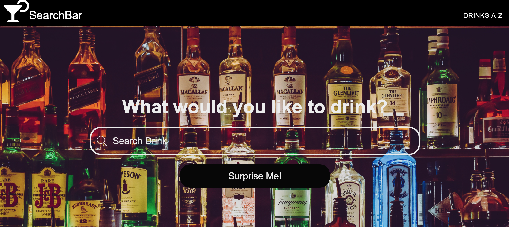
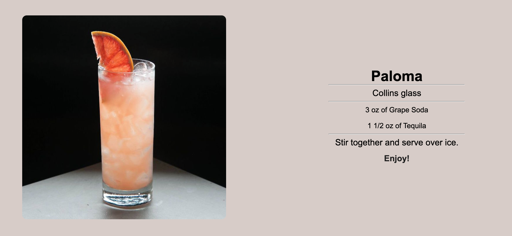
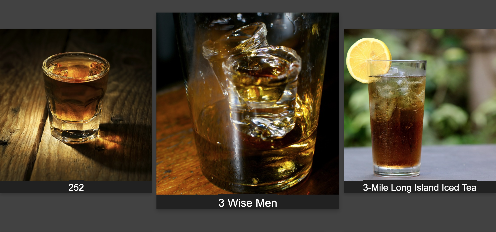

The Search Bar is a React App for users to find detailed instructions on how to make cocktails. Requests are made to The CocktailDB API on the back-end. Result are displayed on the homepage using React.js. A second request is made to display all drinks using CSS Grid. A third request was made to display results of a random drink.

[row]
[col]
[The Search Bar](https://the-search-bar.herokuapp.com "The Search Bar Site")
[/col]

[col]
[GitHub Repo](https://github.com/wyncode/anthony_edwin_johan_sophia "Project Repo")
[/col]
[/row]

[row]
[col]

Above is a snapshot of the detailed drink page. Image and instructions are rendered from API request.

[/col]
[/row]

[row]
[col]

Above is a snapshot of the Drinks A-Z page where results are displayed with CSS Grid and effects on hover for each image.

[/col]
[/row]

